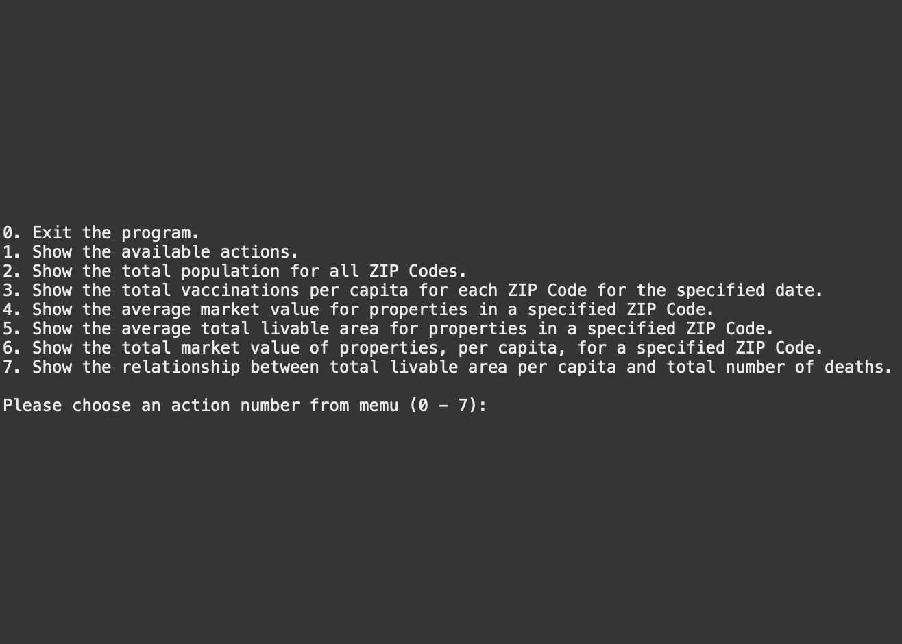

# Philadelphia Covid Data Explorer

## Description
The OpenDataPhilly portal1 offers, for free, more than 300 data sets, applications, and APIs related to the city of Philadelphia. This resource enables government officials, researchers, and the general public to gain a deeper understanding of what is happening in our fair city. The available data sets cover topics such as the environment, real estate, health and human services, transportation, and public safety. The United States Census Bureau2 publishes similar information (and much more) for the nation as a whole.
For this project, the data analysis has been conducted on from these sources. Specifi- cally, you will be given:
• “COVID” data, from the Philadelphia Department of Public Health
• “Properties” data (information about land parcels in the city), from the Philadelphia Office of Property Assessment
• 2020 populations of Philadelphia ZIP Codes, from the US Census Bureau

## Features
- Show the available actions.
- Show the total population for all ZIP Codes.
- Show the total vaccinations per capita for each ZIP Code for the specified date. 
- Show the average market value for properties in a specified ZIP Code.
- Show the average total livable area for properties in a specified ZIP Code. 
- Show the total market value of properties, per capita, for a specified ZIP Code. 
- Show the results of your custom feature.

## Instruction
- Runtime arguments should be in the form “--name=value”. 
- You can include these arguments in an IDE run configuration. In the arguments box you might put:
java -jar Philadelphia-Covid.jar --population=data/population.csv --log=elog.txt --covid=data/covid_data.csv --properties=data/properties.csv
